# km_hospital

Created an hospital management module where there are 5 menus for Patients, Doctors, Departments, Appointments, Medical test.
Each menu have different views (Tree, Form, Search).

## 0. Patients model & view:

Here all the patients information will show in tree view and there is an option for creating new Patient information. 
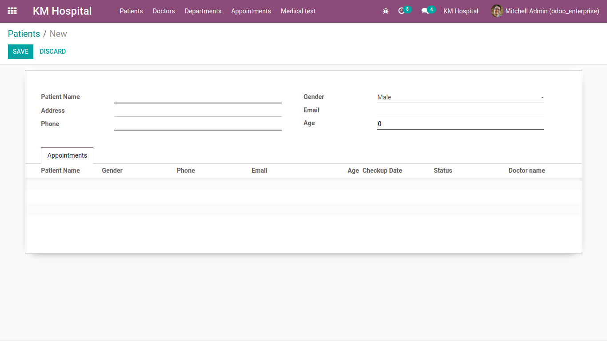

Shows all the patients information on the specific row. 
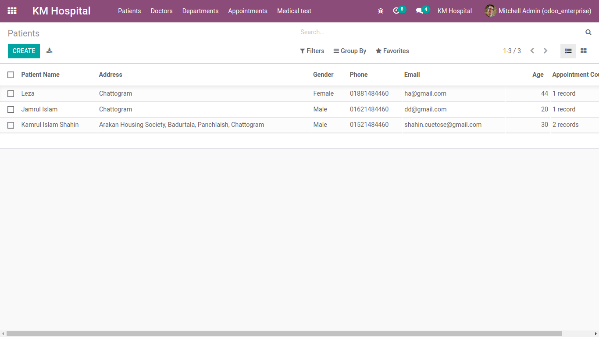

**One2many**: One Patients have many appointments. 
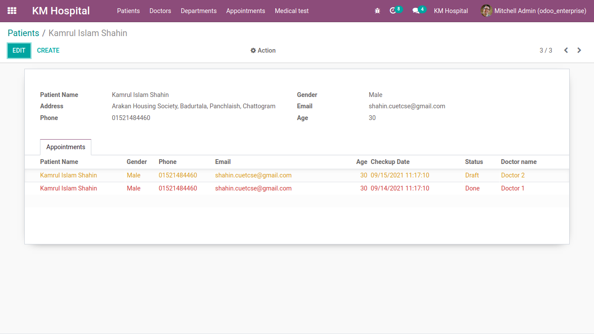

## 1. Doctors model & view:

Here all the Doctors information will show and there is an option for creating new Doctor information. 

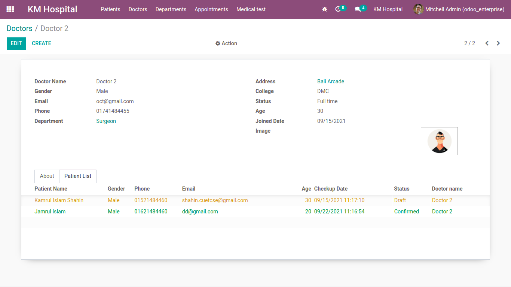

Advanced map view is implemented for showing doctor's location.
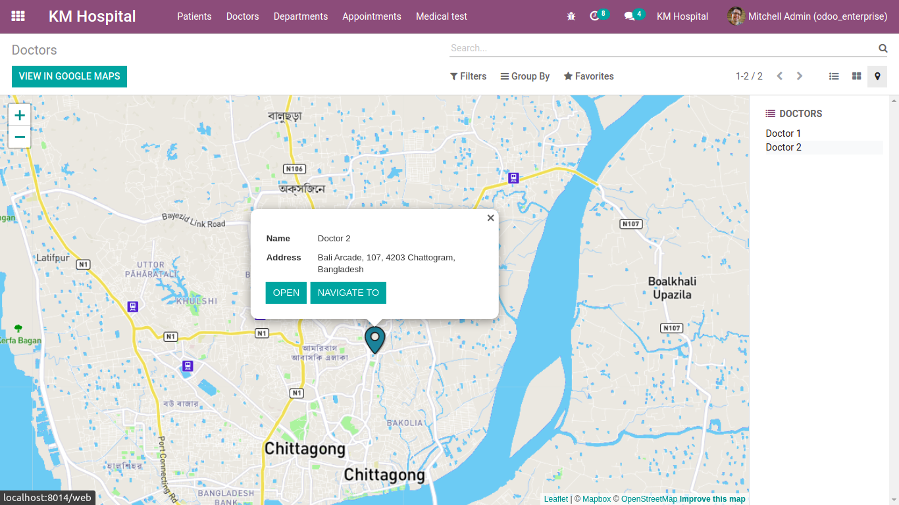

## 2. Department model & view:

Here all the Department information will show and there is an option for creating new Department. 

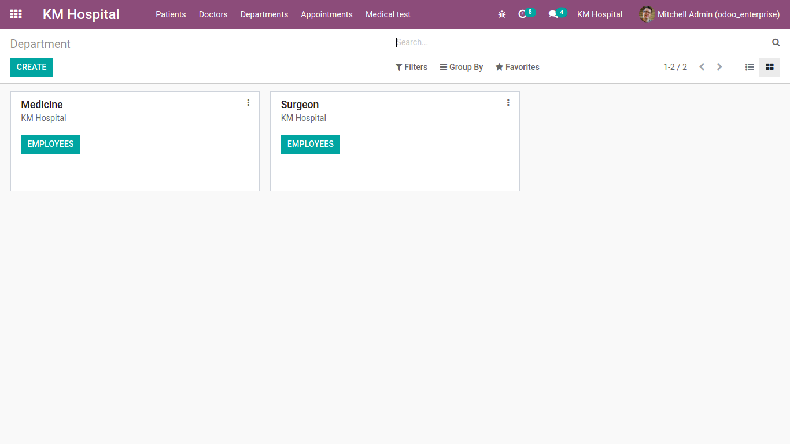

## 3. Appointments model & view:

Here all the Appointments information will show and there is an option for creating new Appointments. 

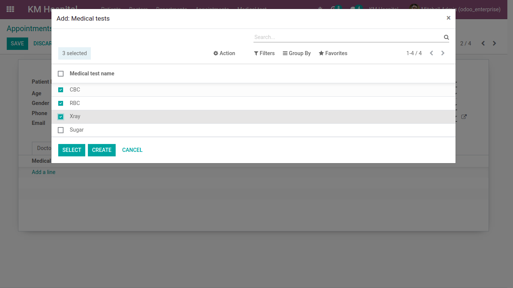
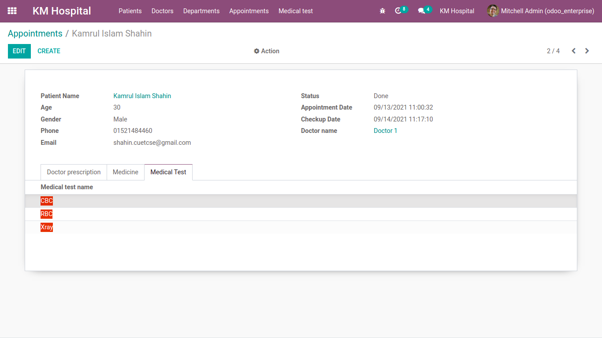
Appointments list view:
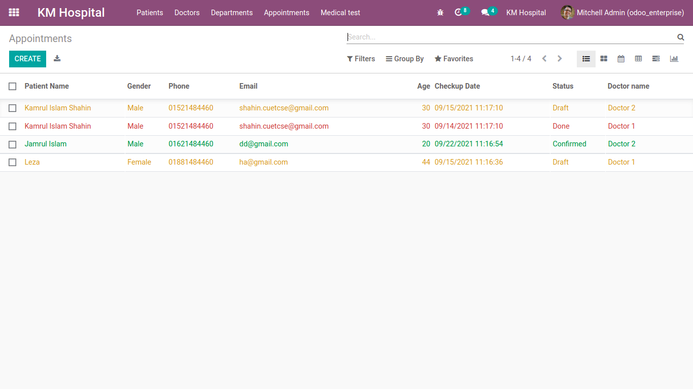
Appointments kanban view:

Appointments calender view:

Appointments pivot view:
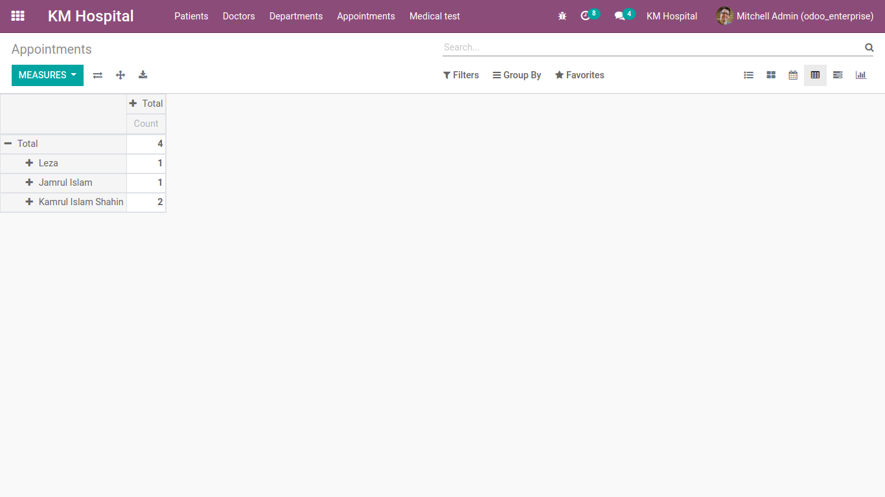
Appointments gantt view:
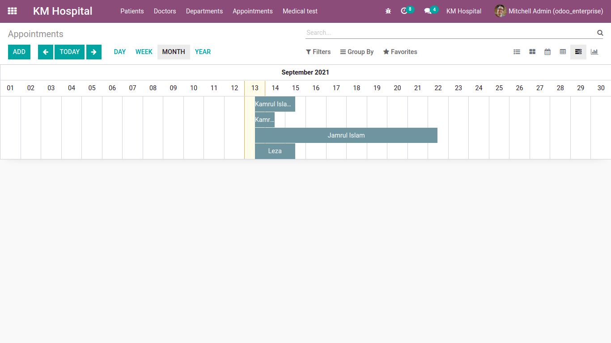
Appointments graph view:
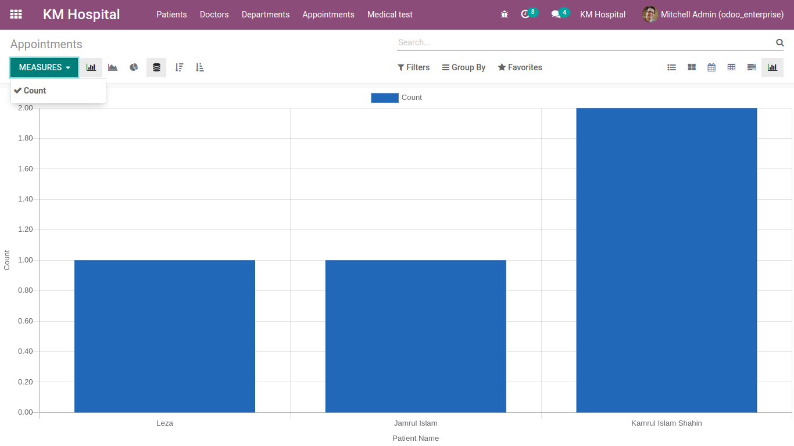
